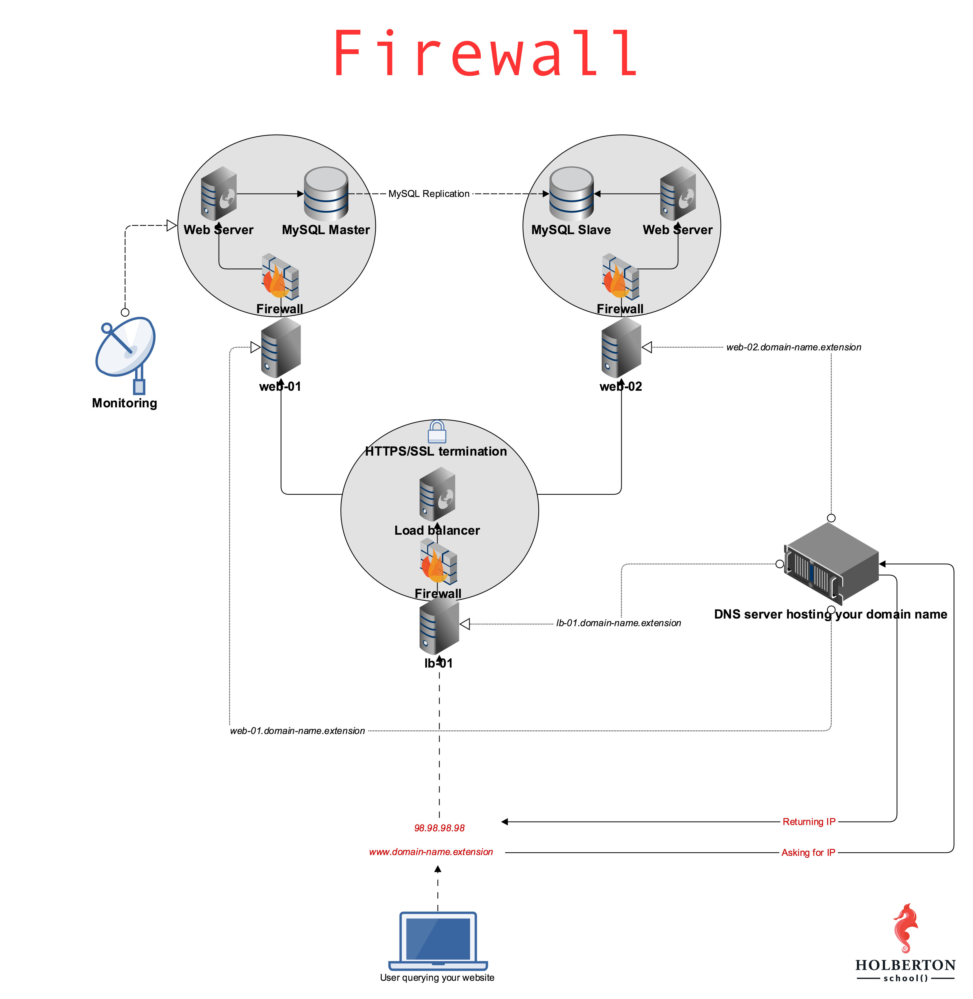

## 0x13. Firewall  

  
---

##### 0. Block all incoming traffic but  

> Let’s install the ufw firewall and setup a few rules on web-01.

Requirements:

- The requirements below must be applied to web-01 (feel free to do it on lb-01 and web-02, but it won’t be checked)
- Configure ufw so that it blocks all incoming traffic, except the following TCP ports:
	- 22 (SSH)
	- 443 (HTTPS SSL)
	- 80 (HTTP)
- Share the ufw commands that you used in your answer file  

###### Commands in the answer file  
- `sudo apt install ufw` - install UFW
- `sudo ufw default deny incoming` - To set the default UFW incoming policy to deny
- `sudo ufw default allow outgoing` - To set the default UFW outgoing policy to allow
- `sudo ufw allow 22` - To allow SSH connections
- `sudo ufw allow 80` - To allow HTTP port 80 which is what unecrypted web servers use.
- `sudo ufw allow 443`- To allow HTTP port 443 which is what encryptedweb servers use.
- `sudo ufw app list` - Check which application profiles are registers in UFW.
- `sudo ufw show added` - Verify which rules were added so far.
- `sudo ufw enable` - enable firewall.
